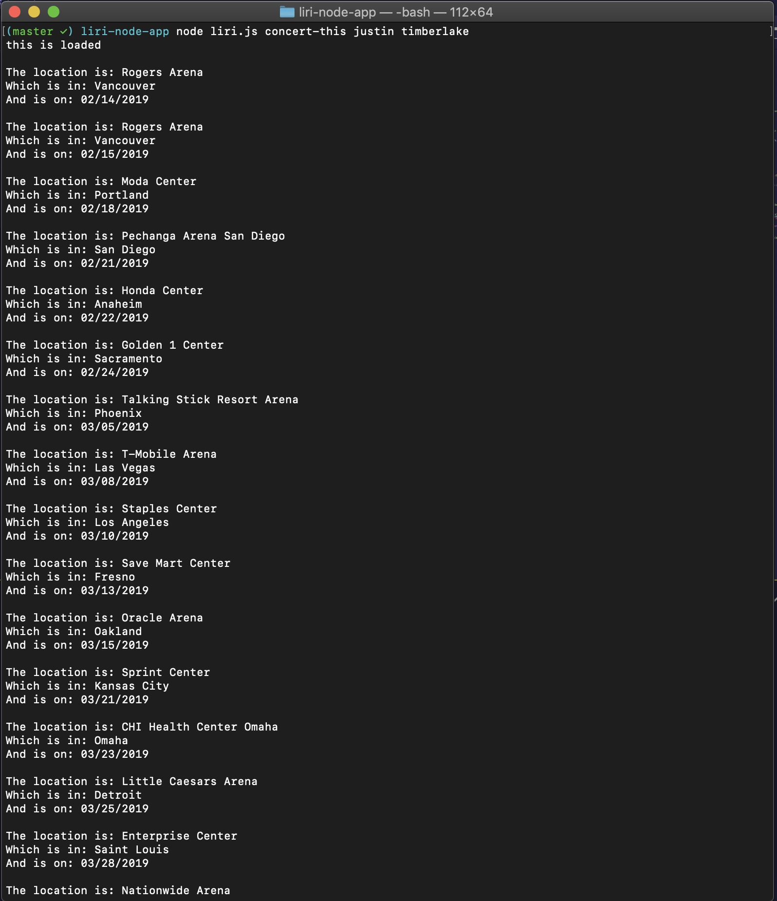
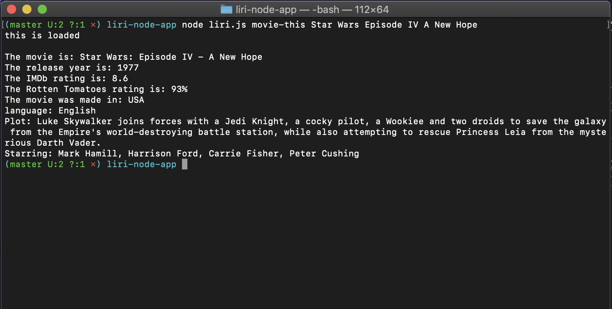
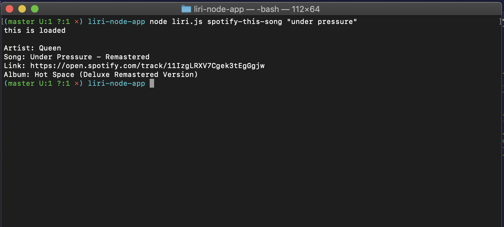
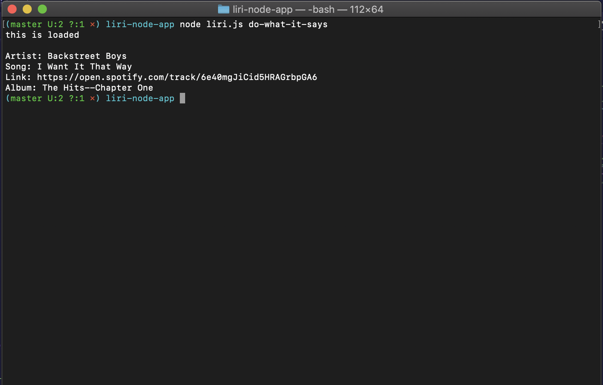

# liri-node-app
# Goal of the project
To create a command line based app that takes certain commands and returns a specific console log for each.

# Commands accepted
#### Commands are entered into the terminal or gitbash in the following format:
#### node liri.js (command) (query)
#### (command) can be one of the following:
- concert-this (artist name) 

- spotify-this-song (song name)

- movie-this (movie name)

- do-what-it-says
  - this option will use data from a provided text file to execute a command

(artist name) (song name) and (movie name) are the **(query)** and you can enter any band, movie, or song. All names can be multiple words or in quotes.

#### Returned data
- concert-this
  - This command will return all the upcoming conerts for the entered artist, the venue, city and date.
- spotify-this-song
  - This command will return the song name, artist, the album, and a link to either a preview or the song itself for the entered song name.
- movie-this
  - This command will return the movie title, the release year, the IMDb rating, the rotten tomatoes rating, the country it was made in, and language, the plot, and the actors.

All searches and responses are saved in the log.txt file.

#### For help and support
Contact Bob Church at bobachu.developer@gmail.com

**[A video of it in action can be seen here](https://drive.google.com/file/d/1mdiq56XPIlLLMqjTpzBYty577WqHeiO_/view)**

## Screenshots:

Project maintained by Bob Church
